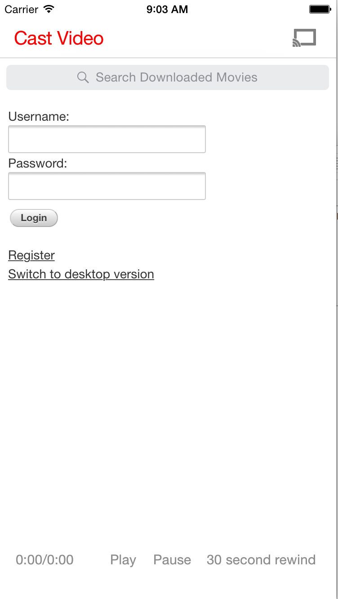
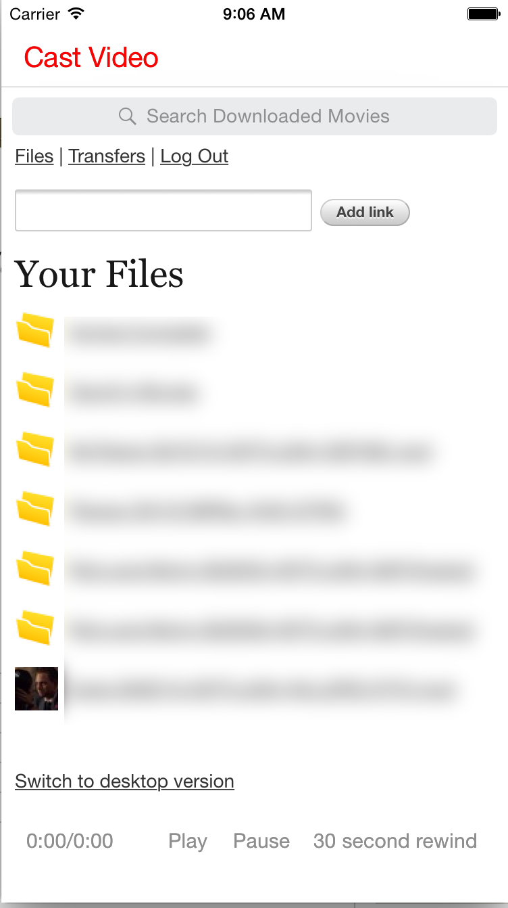
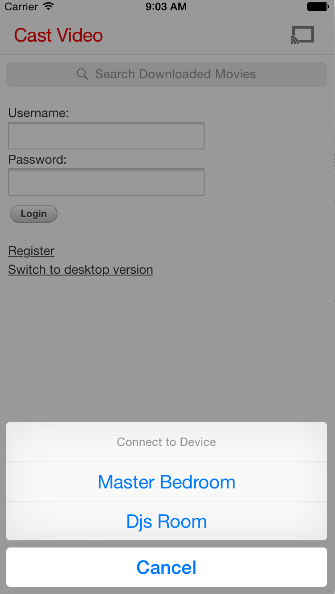
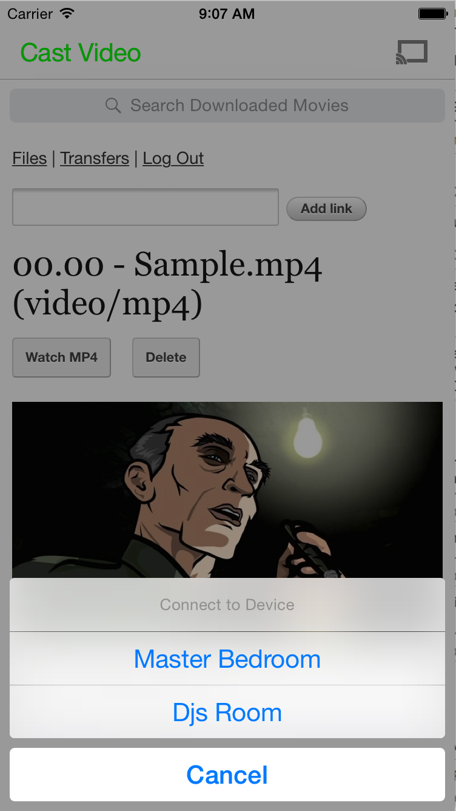
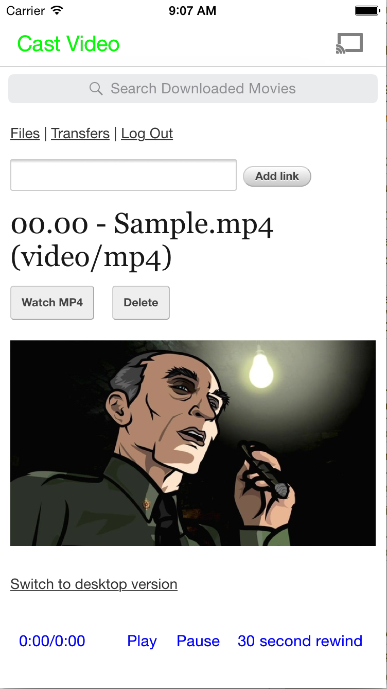

#Caster for iOS 
Streams movies from put.io to chromecast using your iOS device 

#Screenshots 

*Hint - When cast button turns green you can now stream the movie 

#Google Instructions below 

# Cast Hello Video - Swift.

This Hello Video demo application shows how an iOS sender application can cast a video, and make use of the Cast SDK on iOS from Swift. For simplicity this app is not fully compliant with the UX Checklist. 

## Dependencies
* Cocoapods - dependencies are managed via Cocoapods. See http://guides.cocoapods.org/using/getting-started.html for setup instructions.

## Setup Instructions
* Run `pod install` in the CastHelloVideo-Swift directory
* Open the .xcworkspace file rather the the xcproject to ensure you have the pod dependencies. 

# Testing with your own App ID.
* Get a Chromecast device and get it set up for development: https://developers.google.com/cast/docs/developers#Get_started
* Register an application on the Developers Console [http://cast.google.com/publish](http://cast.google.com/publish "Google Cast Developer Console"). The easiest would be to use the Styled Media Receiver option there. You will get an App ID when you finish registering your application.
* In ViewController.swift, replace kGCKMediaDefaultReceiverApplicationID with your app identifier from the Google Cast Developer Console. When you are done, it will look something like: 

## Documentation
Google Cast iOS Sender Overview:  [https://developers.google.com/cast/docs/ios_sender](https://developers.google.com/cast/docs/ios_sender "Google Cast iOS Sender Overview")

## References and How to report bugs
* Cast APIs: [https://developers.google.com/cast/](https://developers.google.com/cast/ "Google Cast Documentation")
* Google Cast Design Checklist [http://developers.google.com/cast/docs/design_checklist](http://developers.google.com/cast/docs/design_checklist "Google Cast Design Checklist")
* If you find any issues, please open a bug here on GitHub
* Question are answered on [StackOverflow](http://stackoverflow.com/questions/tagged/google-cast)

## How to make contributions?
Please read and follow the steps in the [CONTRIBUTING.md](CONTRIBUTING.md)

## License
See [LICENSE](LICENSE)

## Google+
Google Cast Developers Community on Google+ [http://goo.gl/TPLDxj](http://goo.gl/TPLDxj)
